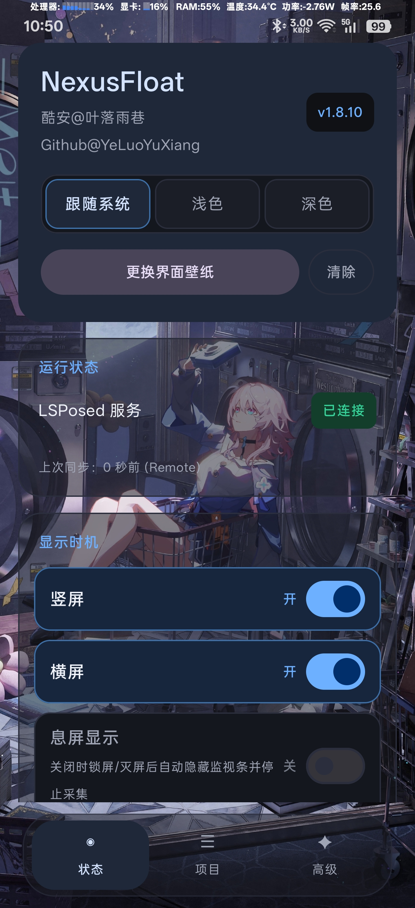

# NexusFloat

酷安@叶落雨巷

一个 LSPosed 模块，在状态栏位置显示一条悬浮性能监视条。


跑在独立悬浮窗里，不是状态栏的子 View，所以全屏玩横屏游戏、看视频时它照常显示，
不用下滑呼出状态栏。竖屏横屏可以分开开关，各项指标各自带开关，关掉的项目不占位置。

## 一、安装和使用

1. 安装 APK
2. LSPosed 里勾选作用域「系统界面」
3. 打开 App 按需配置
4. 按首页「维护」按钮，重启系统界面

GPU 数据需要 root，管理器不授权 root 的话其余指标照常工作。

蓝奏云网盘持续更新链接: https://wwbfn.lanzoum.com/b01gia9ssh
密码:6e83

注意事项:

1. 新版 LSP 启用模块时提示「由于被某个应用遮挡了界面，因此管理器无法验证您的回应」，
   只需要去 LSP 设置里把「界面风格」改为 Material，或者把「点按劫持缓解」关闭。
2. GPU 数据需要 root，管理器不授权 root 的话其余指标照常工作。GPU 实时更新依赖
   App 进程存活，需把耗电改成完全允许后台。
3. 正式版大版本更新必须重装，Debug 版本不要自行尝试安装。
4. 每版本更新内容看首页最下更新日志。

## 二、显示的项目

| 项目 | 说明 |
| --- | --- |
| 时间 | 可切 12 / 24 小时制 |
| CPU | 占用率，可另开频率（最低-最高）和占用柱状图 |
| GPU | 占用率，可另开频率和柱状图 |
| RAM | 占用百分比 |
| ZRAM | 占用百分比 |
| 温度 | 电池温度 |
| 功率 | 电池充放电功率，带正负号 |
| 电流 | 电池电流，带正负号 |
| FPS | 见下面「帧率取数」 |
| CPU温度 | 从 thermal_zone 里自动识别 CPU 那一路 |

默认只开 **CPU、GPU、功率、FPS** 四项，其余在「项目」页里按需打开。

每个项目的显示名称都能自定义，右侧 ↑↓ 调整在监视条上的排列顺序。

## 三、帧率取数

这是我在这个模块花时间最多的地方。FPS 有六个来源，各自一个开关，按下面的顺序
依次尝试，取到就停。数值后面会跟一个来源字母（诊断模式），某个来源在这台机器上
不准时，按字母关掉对应的那个就行。

| 顺序 | 来源 | 字母 | 原理 |
| --- | --- | --- | --- |
| 1 | 面板 measured_fps | p | 高通 sde 驱动给每个 crtc 挂的节点，读的时候现算帧率 |
| 2 | SurfaceFlinger latency | b | 走 Binder 直接问 SurfaceFlinger，按 layer 取帧时间戳 |
| 3 | SurfaceFlinger TimeStats | t | dumpsys 里的逐层帧统计，约 1 秒窗口 |
| 4 | FPSGO | g | 联发科内核按进程统计的 queue buffer 帧率 |
| 5 | GED KPI | f | 联发科 GED 模块的逐进程帧率 |
| 6 | Choreographer | x | 只能测到屏幕刷新率，不是应用帧率，仅作兜底 |

### 1. 高通面板节点

高通的 `measured_fps` 有几个坑，都踩过：

- 每个 crtc 都挂一个节点，只有主屏那个是真实读数，其余恒为 0。不能取第一个，
  要把通配展开成具体路径逐个读。
- 主屏 crtc 不一定叫 `crtc-0`。骁龙 8 Gen 3 / 8 Elite 上主屏藏在「外部 crtc」
  下面，路径形如 `/sys/class/drm/card0-sde-crtc-2/device/card0-sde-crtc-0/measured_fps`，
  通配得写到五层深。
- 节点内容是读取时现算的：内核从每帧时间戳的环形缓冲里往前找跨度够 1 秒的那帧，
  帧数除以时间差就是帧率。原版内核输出 `fps: 59.4`，ColorOS / HyperOS 会多带
  `duration` 和 `frame_count`。
- `frame_count` 是「当前时刻往前 1 秒窗口里的帧数」，不是累积器，随读取时机变化。
  早先版本拿它当「面板有没有在出帧」的判据，结果窗口内帧数少于一帧时整个面板方案
  被判死，这就是「p 方案突然不工作」的来源。现在只看 `fps` 字段。

面板读不到时会退回 `vsync_event` 差分：那是内核写的 vsync 中断时间戳，主屏那个非零、
闲置 crtc 恒为 0，两次读数相减就是帧率。

### 2. TimeStats

逐层的帧统计。直接按累计帧数排名会把静止的壁纸、桌面排到前面，所以做了几件事：
启用时先清零统计；只取前 32 层；排除状态栏、监视条自身这类每秒 1 帧的噪声层；
优先匹配前台包名对应的 layer。

## 四、取数开销

监视条每秒读一轮节点。root 通道不用 `cat`。

一开始的写法是常驻一个 `su`，每读一个节点发一条 `cat path`。常驻 su 省掉了 su 自身的
fork，但 `cat` 在 Android 上是 toybox 的软链，每次都要 fork + exec 一次 toybox。
一轮采集扫十几个候选路径，等于每秒十几次进程创建，这才是耗电的大头。

现在改用 shell 内建的 `read`：

```sh
read -r v < /sys/class/.../scaling_cur_freq
```

完全在 shell 进程内完成，零 fork。再把一轮里的所有路径合并成一条命令、一次管道往返
读回来，于是：

| | 旧 | 现在 |
| --- | --- | --- |
| 每轮进程创建 | 十几次 | 0 |
| 每轮管道往返 | 每节点一次 | 一次 |

读不到时按退避策略降低重扫频率：连续 3 轮没命中就转退避，之后每 5 轮真扫一次。
这个 5 轮是从 60 轮降下来的。60 轮意味着锁屏期间退避一路累积，亮屏后要等近一分钟
才恢复出数。

## 五、模块结构

装完之后有两部分在跑。

### 1. SystemUI 进程（被 LSPosed 注入）

- 挂监视条悬浮窗，按屏幕方向、应用白名单、亮灭屏状态决定显示与否
- 自己读 CPU / RAM / 温度 / 部分 GPU 节点
- 隐藏时不只是不可见，采集线程一并停掉

注入走了两条路，互为备份：

- Hook 折叠状态栏 Fragment 的 `onViewCreated`，能直接拿到状态栏的 View 树。
  类名在 Android 各版本里改过多次，所以维护了一张候选表逐个试。
- Hook `Instrumentation.callApplicationOnCreate` 和 `Application.attach`，
  再轮询 `ActivityThread.currentApplication()`。这条路不依赖任何 ROM 类名，
  是 Fragment 全部改名后的保命通道。

### 2. 模块 App 进程

- 用常驻 root shell 读 GPU 频率和占用，读到后写给 SystemUI
- 保持常驻，供 SystemUI 随时取数

SystemUI 里 su 不可靠（SELinux 对 system_server 类进程管得严），所以 GPU 取数放在
普通 App 进程里做。1.8.6 起 SystemUI 侧也会先自己试一次 root 直读，读不到才等
App 进程传，这样重启后 App 进程没起来时 GPU 数据也不会断。

ColorOS 在最近任务里点「全部清除」会把模块进程置为 stopped 状态（等同
`am force-stop`），这种状态下系统拒绝 ContentProvider query 之类的隐式唤醒，
GPU 数据会一直停更；划卡只是普通杀进程，不置 stopped，所以划卡没事。

「显示时机」里的「后台唤醒」就是修这个的：SystemUI 按设定间隔（默认 15 秒）
发一条带 `FLAG_INCLUDE_STOPPED_PACKAGES` 的显式广播。这是系统对 stopped 应用
唯一放行的口子，flag 由发送方加，而发送方就是被注入的 SystemUI 进程，
所以不用 hook 系统框架、也不用把模块作用域扩到 system。设 0 可关闭。

### 3. 设置怎么同步

App 改设置，SystemUI 得知道。三层通道依次尝试：

- RemotePreferences（LSPosed 提供的跨进程 prefs）
- ContentProvider 快照——App 侧把设置写进一个 exported Provider，SystemUI 直接查
- `Settings.Global` 里的 Base64 blob——前两条都不通时由 root 写入

三条都不要求 LSPosed 服务绑定成功，所以 App 界面显示「未连接」时设置照样能生效。

## 六、App 界面

底部三个页签：

- 状态——LSPosed 连接状态、显示时机、重启系统界面、使用须知
- 项目——各指标开关与自定义名称、显示顺序、空格自定义、外观与校正
- 高级——FPS 六个来源开关、预设、刷新时间

界面支持浅色 / 深色 / 跟随系统，也可以选一张手机里的图片当背景。



## 七、关于空格

监视条默认各项紧贴、不留空格。想在哪里留空，在「项目」页的「空格自定义」里填
「项目名+空格数」，比如 `ZRAM2` 表示 ZRAM 前面加 2 个空格，多个用逗号隔开。

## 八、已知限制

- 联发科没有 `measured_fps` 这类节点，面板来源用不了，只能走 FPSGO / GED / TimeStats
- Choreographer 测的是屏幕刷新率，静态画面下它照样显示 120，不是真实帧率
- 部分 ROM 把 root 节点藏得很深，需要在新版系统上补路径
- 息屏后是否继续显示由「显示时机」里的开关控制，默认关闭

## 九、参与

感谢酷安@我是一个小马jia 的灵感
感谢QQ测试群大伙的热心测试。

FPS 相关问题的反馈方式见 [CONTRIBUTING.md](CONTRIBUTING.md)。

## 十、许可

GPLv3，见 [LICENSE](LICENSE)。

仅供学习研究。模块需要 root 与 LSPosed，使用导致的一切后果由使用者自负。
